# DevOps Internship Assessment

## Table of Contents
1. [Project Overview](#project-overview)
2. [Project Requirements](#project-requirements)
2. [Part 1 - Dockerization & CI](#part-1---dockerization--ci)
3. [Part 2 - Ansible VM Setup](#part-2---ansible-vm-setup)
4. [Part 3 - Docker Compose & Auto Updates](#part-3---docker-compose--auto-updates)
5. [Part 4 (Bonus) - Kubernetes + ArgoCD](#part-4-bonus---kubernetes--argocd)
6. [Screenshots](#screenshots)
7. [Assumptions & Notes](#assumptions--notes)

---

## Project Overview

A DevOps implementation of a todo-list pre-made app covering containerization, automation, CI/CD, and deployment strategies.

---

## Project Requirements

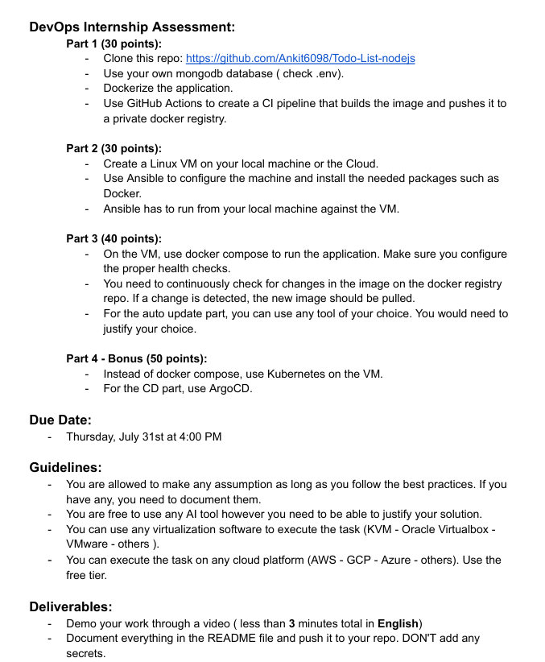

---

## Part 1 - Dockerization & CI (30 points)

### Step 1: Clone Repository

```bash
git clone https://github.com/Ankit6098/Todo-List-nodejs
cd Todo-List-nodejs
```

> **Local Path:**  
> `C:\Users\Legion\Todo-List-nodejs`

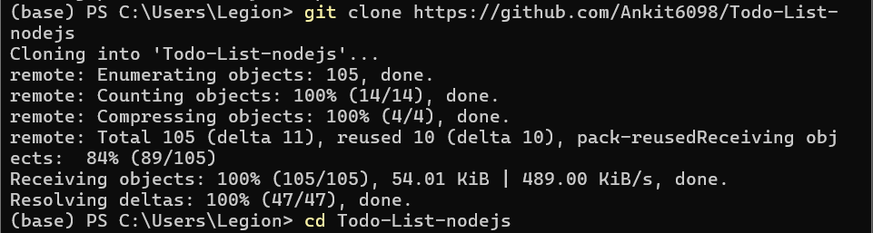

---

### Step 2: Run MongoDB in Docker

```bash
docker run -d -p 27017:27017 --name mongo mongo
```

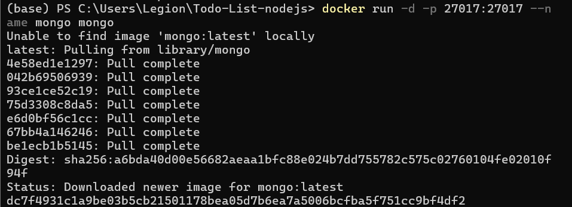

---

### Step 3: Update `.env` for MongoDB

```env
MONGO_URI=mongodb://host.docker.internal:27017/todoapp
```

---

### Step 4: Create Dockerfile

```Dockerfile
FROM node:18

WORKDIR /app

COPY package*.json ./
RUN npm install

COPY . .

EXPOSE 3000

CMD ["npm", "start"]
```

---

### Step 5: Build Image

```bash
docker build -t todo-app .
```

---

### Fix: `.env` not loading (MONGO_URI = null)

- Inspected `index.js` and added:

```js
require('dotenv').config();
```

- Still didn't work — added the same line to `config/mongoose.js` because Mongoose was being initialized before `.env` was loaded.

```js
// At the top of config/mongoose.js
require('dotenv').config();
const mongoose = require('mongoose');

mongoose.connect(process.env.MONGO_URI, {
  useNewUrlParser: true,
  useUnifiedTopology: true,
});

console.log("MONGO_URI from ENV:", process.env.MONGO_URI);
```

---

### Step 6: Rebuild & Run Container

```bash
docker build -t todo-app .
docker run -p 4080:4000 --env-file .env todo-app
```

- Verified app loaded at: [http://localhost:4080](http://localhost:4080)

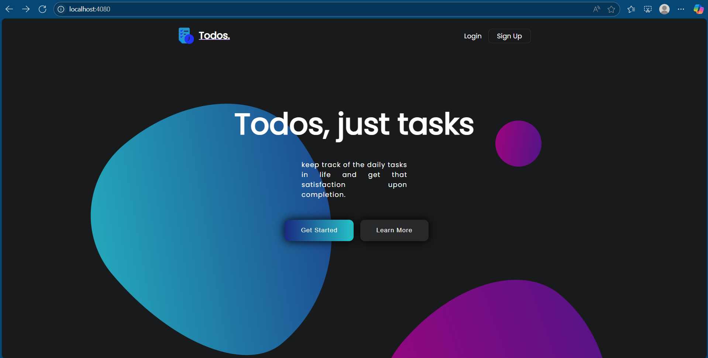

---

### Step 7: Tag & Push Image to Docker Hub

```bash
docker tag todo-app omaraboagla/todo-app:latest
docker push omaraboagla/todo-app:latest
```

---

### Step 8: Setup GitHub Repository

**Repository:** `omaraboagla/fortstakassessment`

#### Initialize Git and Push

```bash
git init
git remote remove origin
git remote add origin https://github.com/YOUR_USERNAME/todo-app-docker.git
git branch -M main
git add .
git commit -m "Initial commit"
git push -u origin main
```

---

### Step 9: GitHub Actions CI Setup

**Created GitHub Secrets:**
- `DOCKER_USERNAME`
- `DOCKER_PASSWORD`

**Created Workflow File:** `.github/workflows/docker-publish.yml`

```yaml
name: Build and Push Docker Image

on:
  push:
    branches: [ main ]

jobs:
  build:
    runs-on: ubuntu-latest

    steps:
      - name: Checkout code
        uses: actions/checkout@v3

      - name: Log in to Docker Hub
        uses: docker/login-action@v3
        with:
          username: ${{ secrets.DOCKER_USERNAME }}
          password: ${{ secrets.DOCKER_PASSWORD }}

      - name: Build and push Docker image
        uses: docker/build-push-action@v5
        with:
          context: .
          file: ./Dockerfile
          push: true
          tags: omaraboagla/fortstakassessment:latest
```

---

### CI Build Error: Dockerfile Not Found

- GitHub Actions failed to find the Dockerfile. Fixed it by explicitly adding the `file: ./Dockerfile` field under the `with` block in the workflow file.

#### Fixed and Pushed:

```bash
git add .
git commit -m "Fix Dockerfile path for Github Actions"
git push
```

---

### Final Outcome

- GitHub Actions now:
  1. Detects code changes to `main`
  2. Builds Docker image
  3. Logs into Docker Hub
  4. Pushes updated image to `omaraboagla/fortstakassessment`

> Verified: Docker image appears in Docker Hub successfully.

---

## Part 2 - Ansible VM Setup

### WSL2 as Target VM

- Used **WSL2 Ubuntu 24.04** as the remote Linux VM on Windows 11.
- Functions as a fully isolated Linux machine with its own IP.

```bash
wsl --install -d Ubuntu
```

> Output: `A distribution with the supplied name already exists.`  
> → WSL2 already installed.

---

### Create `devops` User in WSL2

```bash
sudo adduser devops
sudo usermod -aG sudo devops
```

> **Goal:** This user will be the SSH + Ansible target.

---

### Enable Passwordless `sudo` for Ansible

```bash
sudo visudo
```

At the end of the file, added:

```text
devops ALL=(ALL) NOPASSWD:ALL
```

---

### Get WSL2 IP Address

```bash
ip addr | grep inet
```

> Resulted in: `192.168.118.152`  
> → Used as Ansible target in inventory.

---

### Install Ansible & sshpass (Control Node)

```bash
sudo apt update
sudo apt install ansible -y
sudo apt install sshpass -y
```

---

### Ansible Project Structure

```bash
mkdir ~/ansible-docker-vm
cd ~/ansible-docker-vm
```

---

### Create `inventory.ini`

```ini
[dev]
192.168.118.152 ansible_user=devops ansible_ssh_pass=YOUR_PASSWORD ansible_python_interpreter=/usr/bin/python3
```

---

### SSH Error: Host Key Check

Ansible failed due to unknown host key. Fixed by manually accepting the SSH fingerprint:

```bash
ssh devops@192.168.118.152
```

> Typed `yes` to trust the host permanently.

---

### Create Ansible Playbook

**Filename:** `install-docker.yml`

```yaml
---
- name: Setup Docker on remote Linux VM
  hosts: dev
  become: true
  tasks:
    - name: Install required packages
      apt:
        name:
          - apt-transport-https
          - ca-certificates
          - curl
          - gnupg
          - lsb-release
        update_cache: yes

    - name: Add Docker GPG key
      apt_key:
        url: https://download.docker.com/linux/ubuntu/gpg
        state: present

    - name: Add Docker APT repo
      apt_repository:
        repo: "deb [arch=amd64] https://download.docker.com/linux/ubuntu {{ ansible_distribution_release }} stable"
        state: present

    - name: Install Docker
      apt:
        name:
          - docker-ce
          - docker-ce-cli
          - containerd.io
        update_cache: yes
        state: latest

    - name: Start Docker service
      service:
        name: docker
        state: started
        enabled: true

    - name: Add user to docker group
      user:
        name: devops
        groups: docker
        append: yes
```

---

### Run the Playbook

```bash
ansible-playbook -i inventory.ini install-docker.yml
```

---

### Output Summary

- Facts gathered ✅  
- Dependencies installed ✅  
- Docker GPG key + repo added ✅  
- Docker engine installed ✅  
- `devops` added to docker group ✅  
- Docker service enabled ✅

---

### Verification (Post-Setup)

```bash
ssh devops@192.168.118.152
docker --version
```

> Output: `Docker version 28.3.2, build 578ccf6`

```bash
docker ps
```

> Output: Shows Docker is installed and running.

---


## Part 3 - Docker Compose & Auto Updates

### Docker Compose Deployment Directory

```bash
mkdir ~/todo-deployment
cd ~/todo-deployment
```

---

### Chose Auto-Update Tool: Watchtower

**Why Watchtower?**
- Fully Docker-native solution
- Automatically detects and applies image updates
- Simple setup with one-liner configuration
- Supports private registries
- Monitors containers in real time (`--interval 30`)

---

### Docker Compose Configuration

**Filename:** `docker-compose.yml`

```yaml
services:
  mongo:
    image: mongo
    container_name: mongo
    restart: always
    ports:
      - "27018:27017"  # Avoid port clash with Part 1
    healthcheck:
      test: ["CMD", "mongo", "--eval", "db.adminCommand('ping')"]
      interval: 10s
      timeout: 5s
      retries: 5
    volumes:
      - mongo_data:/data/db

  todo-app:
    image: omaraboagla/fortstakassessment:latest
    container_name: todo-app
    restart: always
    ports:
      - "4000:4000"
    depends_on:
      mongo:
        condition: service_healthy
    environment:
      - MONGO_URI=mongodb://mongo:27017/todoapp

  watchtower:
    image: containrrr/watchtower
    container_name: watchtower
    restart: always
    volumes:
      - /var/run/docker.sock:/var/run/docker.sock
    command: --interval 30 todo-app

volumes:
  mongo_data:
```

---

### Healthchecks for Mongo

```yaml
healthcheck:
  test: ["CMD", "mongo", "--eval", "db.adminCommand('ping')"]
  interval: 10s
  timeout: 5s
  retries: 5
```

> Verifies Mongo is **actually responsive**, not just running.

---

### Launch the Stack

```bash
docker compose up -d
```

- All services launched successfully
- Mongo became **healthy** via healthcheck
- Verified using:

```bash
docker inspect mongo | grep -A10 Health
```

---

### Validate Running Services

```bash
docker ps
```

> ✅ `mongo` on port 27018  
> ✅ `todo-app` on port 4000  
> ✅ `watchtower` active and watching

---

### Test: Watchtower Auto-Update

1. Edited UI file `dashboard.ejs`, changed heading text:

```html
<h1>Todos, just tasks This is a change test</h1>
```

2. Rebuilt and pushed new image:

```bash
docker build -t omaraboagla/fortstakassessment:latest .
docker push omaraboagla/fortstakassessment:latest
```

3. Watched logs:

```bash
docker logs watchtower
```

> Output:

```
Found new omaraboagla/fortstakassessment:latest image (1c3398e52f73)
Stopping /todo-app (7697a53fb8bd) with SIGTERM
Creating /todo-app
Session done  Failed=0 Scanned=1 Updated=1 notify=no
```

4. Refreshed browser at [http://localhost:4000](http://localhost:4000)  
   → Header was updated successfully!

---


## Part 4 Bonus - Kubernetes + ArgoCD

### Attempted K3s Installation

- Attempted to install and start a native **K3s cluster** on WSL2.
- Faced repeated startup issues due to WSL2’s limited kernel features and lack of certain Linux components.
- Switched to **K3d** (a lightweight wrapper to run K3s in Docker), ideal for WSL2 setups.

---

### Start K3d Cluster

```bash
k3d cluster create todo-cluster --agents 1
```

```bash
kubectl get nodes
```

---

### Import Local Docker Image into K3d

```bash
docker build -t todo-app:latest .
k3d image import todo-app:latest -c todo-cluster
```

---

### Created Kubernetes Deployment & Service

**File 1: `todo-deployment.yaml`**

```yaml
apiVersion: apps/v1
kind: Deployment
metadata:
  name: todo-app
spec:
  replicas: 1
  selector:
    matchLabels:
      app: todo
  template:
    metadata:
      labels:
        app: todo
    spec:
      containers:
        - name: todo-app
          image: todo-app:latest
          ports:
            - containerPort: 4001
          env:
            - name: MONGO_URL
              value: mongodb://host.k3d.internal:27018
```

**File 2: `todo-service.yaml`**

```yaml
apiVersion: v1
kind: Service
metadata:
  name: todo-service
spec:
  selector:
    app: todo
  ports:
    - protocol: TCP
      port: 4001
      targetPort: 4001
```

---

### Apply K8s Manifests

```bash
kubectl apply -f todo-deployment.yaml
kubectl apply -f todo-service.yaml
```

- Faced `ImagePullBackOff` because image was not public.
- Fixed by:
  - Manually importing the image using `k3d image import`
  - Deleting failed pod:

```bash
kubectl delete pod -l app=todo
```

- Verified pod now runs:

```bash
kubectl get pods
kubectl get svc
```

---

### Port Forward Service to Host Machine

```bash
kubectl port-forward service/todo-service 4001:4001
```

- Tested at [http://localhost:4001](http://localhost:4001)
- Todo app works successfully!

---

### Deploying with ArgoCD (GitOps)

**Step 1: Install ArgoCD**

```bash
kubectl create namespace argocd
kubectl apply -n argocd -f https://raw.githubusercontent.com/argoproj/argo-cd/stable/manifests/install.yaml
```

**Step 2: Expose ArgoCD UI**

```bash
kubectl port-forward svc/argocd-server -n argocd 8080:443
```

→ Access at [http://localhost:8080](http://localhost:8080)

---

### GitOps Directory Structure

```
~/todo-deployment/
├── todo-deployment.yaml
├── todo-service.yaml
└── kustomization.yaml
```

**File: `kustomization.yaml`**

```yaml
resources:
  - todo-deployment.yaml
  - todo-service.yaml
```

---

### ArgoCD Application Config

**File: `argo-app.yaml`**

```yaml
apiVersion: argoproj.io/v1alpha1
kind: Application
metadata:
  name: todo-app
  namespace: argocd
spec:
  destination:
    server: https://kubernetes.default.svc
    namespace: default
  project: default
  source:
    repoURL: file:///home/devops/todo-deployment
    targetRevision: HEAD
    path: .
  syncPolicy:
    automated:
      prune: true
      selfHeal: true
```

---

### Apply ArgoCD App

```bash
kubectl apply -f argo-app.yaml
```

```bash
kubectl get applications -n argocd
kubectl describe application todo-app -n argocd
```

---

### Login to ArgoCD Web UI

Get default admin password:

```bash
kubectl -n argocd get secret argocd-initial-admin-secret \
  -o jsonpath="{.data.password}" | base64 -d && echo
```

> Username: `admin`  
> Password: (e.g. `gsCjdDT7Kb3hkElv`)

---

### Verified in ArgoCD UI

1. `todo-app` application is listed
2. Status: ✅ **Synced** and ✅ **Healthy**
3. Clicking reveals `todo-deployment` and `todo-service`

---
## Screenshots

### 📦 Part 1 - Dockerization & CI

- 
- 
- 

---

### 🧰 Part 2 - Ansible VM Setup

- 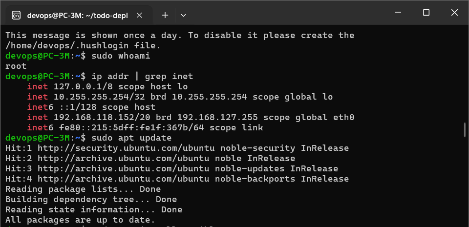
- 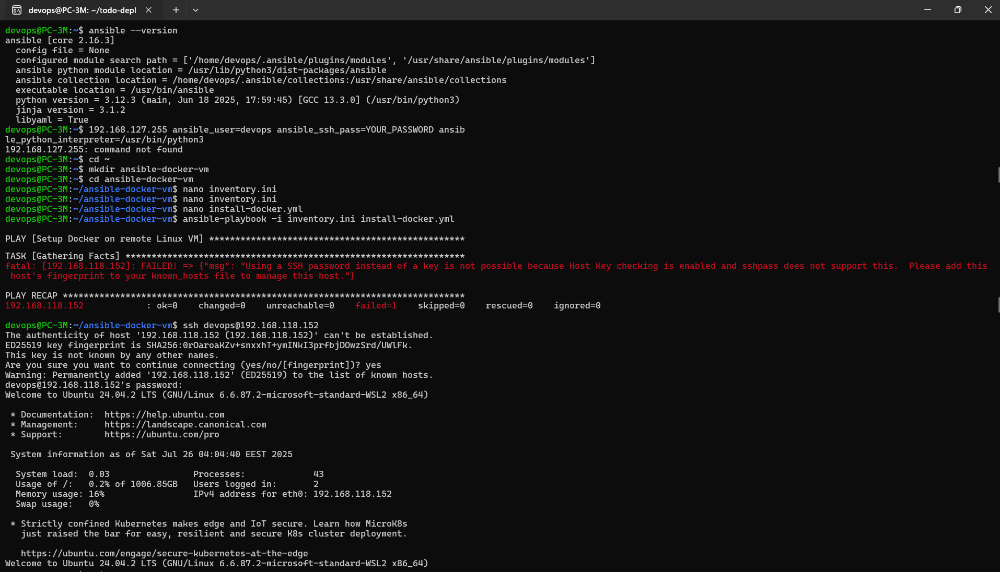
- 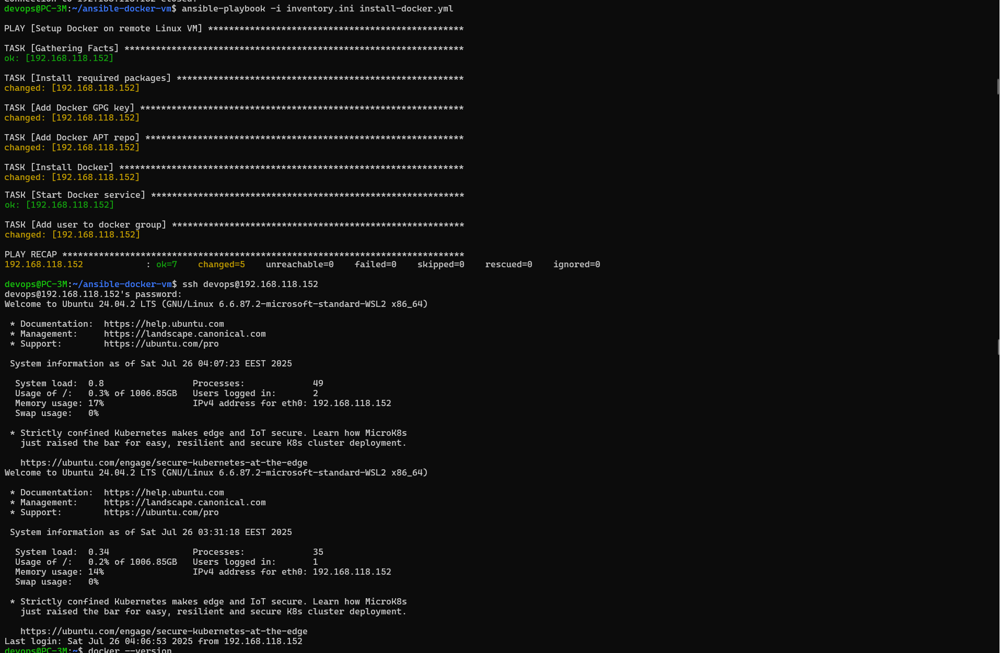
- 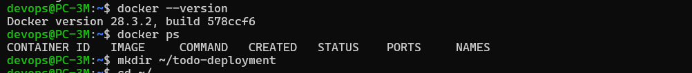

---

### 🐳 Part 3 - Docker Compose & Auto Updates

- 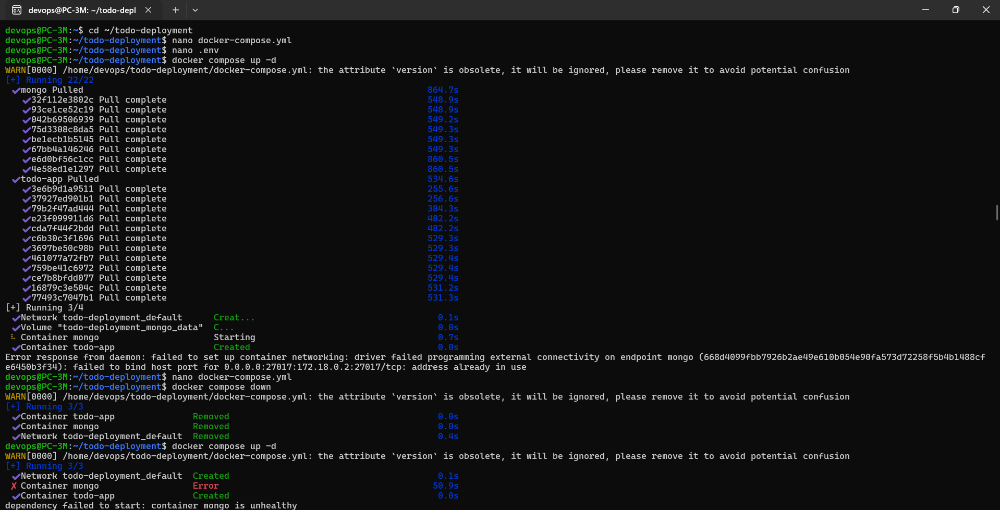
- 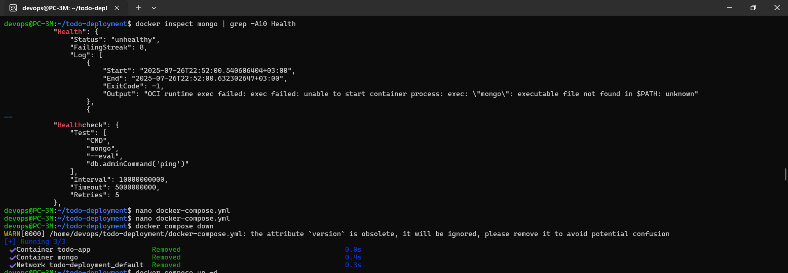
- 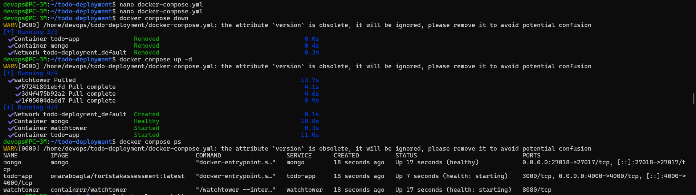
- 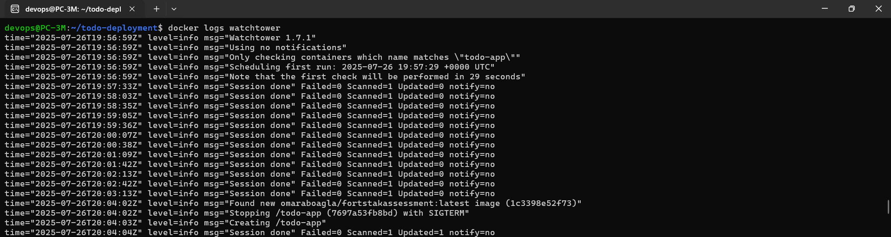
- 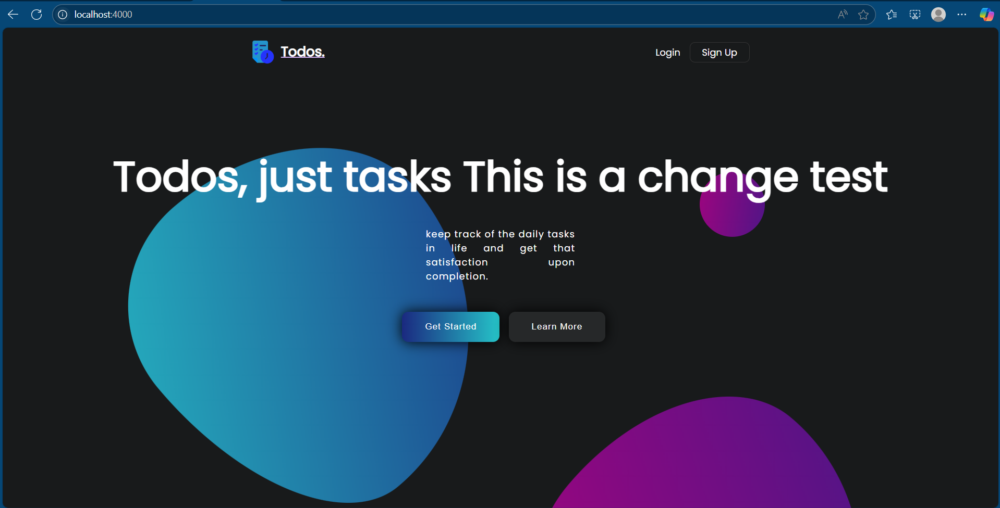

---

### ☸️ Part 4 - Kubernetes + ArgoCD

- 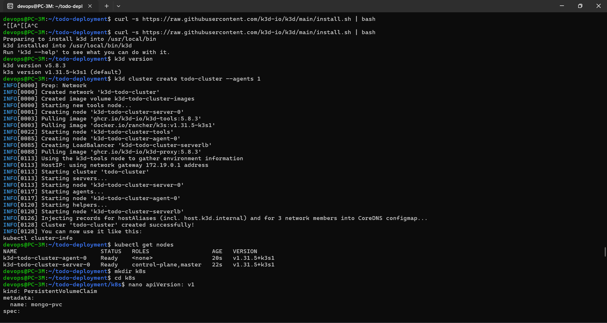
- 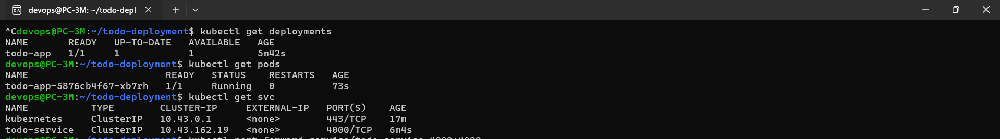
- 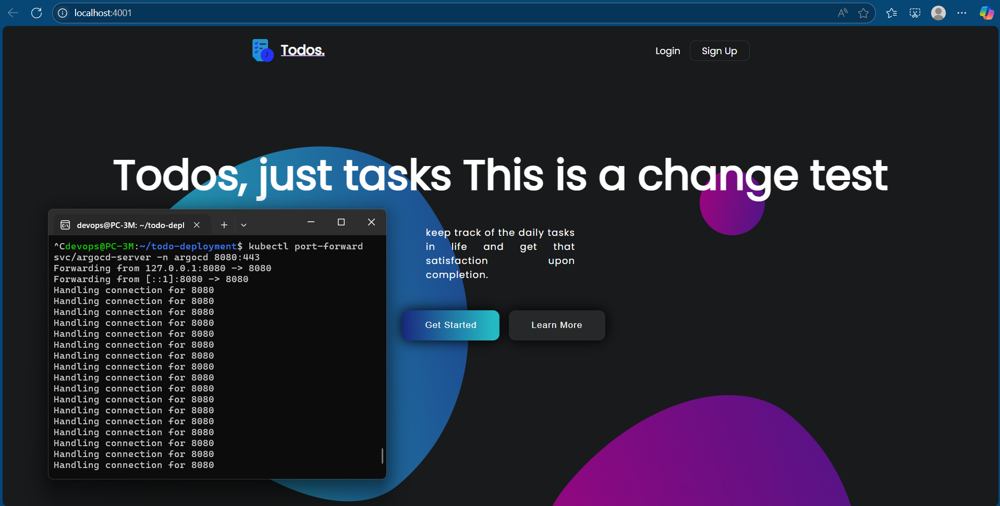
- 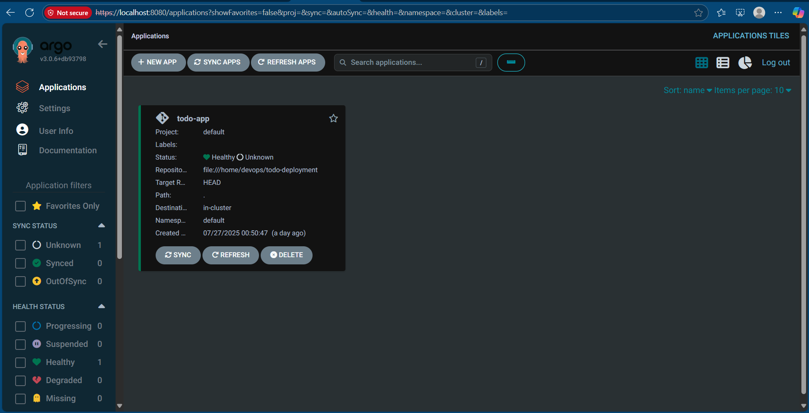
- 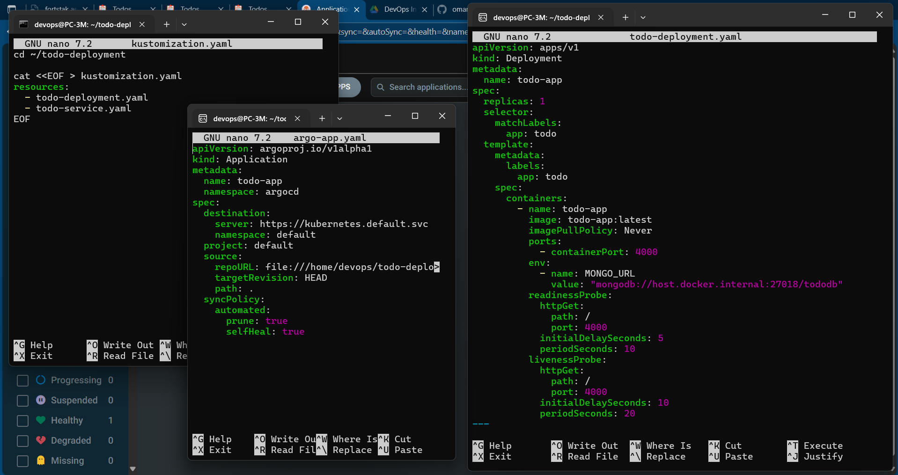


## Screenshots

Screenshots used throughout the documentation are located in the `images/` subfolder.

- `images/img1.png`: Cloning the repository  
- `images/img2.png`: MongoDB running in Docker  
- `images/img3.png`: App running on localhost  
- `images/img4.png`: WSL2 Ubuntu with IP discovery via `ip addr`
- `images/img5.png`: SSH access to target with Ansible inventory setup
- `images/img6.png`: Playbook run output (Ansible installing Docker)
- `images/img7.png`: Docker version + `docker ps` output after installation
- `images/img8.png`: Docker Compose file and folder structure
- `images/img9.png`: `docker inspect mongo` showing health status
- `images/img10.png`: Output of `docker ps` showing all 3 containers running
- `images/img11.png`: Watchtower logs detecting and pulling a new image
- `images/img12.png`: Web app after header update (UI shows updated text)
- `images/img13.png`: Output of `kubectl get nodes` showing working K3d cluster
- `images/img14.png`: Output of `kubectl get pods` after image import
- `images/img15.png`: Port-forward success and browser view of http://localhost:4001
- `images/img16.png`: ArgoCD web UI showing `todo-app` in synced/healthy state
- `images/img17.png`: YAML structure in ~/todo-deployment folder (with kustomization.yaml)

---

## Assumptions & Notes

- `.env` loading issues were solved by requiring it explicitly in both `index.js` and `mongoose.js`.
- GitHub Actions requires the `Dockerfile` path to be defined explicitly.
- MongoDB runs locally in a Docker container and connects using `host.docker.internal`.
- WSL2 acts as a reliable substitute for a remote Linux VM.
- Password-based SSH was used for simplicity via `sshpass`.
- Passwordless sudo was enabled to allow Ansible `become: true` to work.
- Host key acceptance was required once to populate `known_hosts`.
- Ansible control and target were both within WSL but operated with unique IP addressing.
- Watchtower was used instead of scripting or GitHub CI/CD tools to meet the auto-update requirement in a Docker-native way.
- Mongo was exposed on port `27018` to avoid conflict with previously running services.
- Healthchecks were added to ensure Mongo is responsive before launching the dependent `todo-app` container.
- Changes to the app image were simulated by editing a visible UI element and pushing to Docker Hub.
- Watchtower correctly detected and applied the update within its 30s interval window.
- K3s was incompatible with WSL2 due to missing Linux features, so used K3d instead.
- K3d requires image import for local Docker builds.
- MongoDB from Part 3 was reused by referencing `host.k3d.internal:27018`.
- ArgoCD used a local `file://` source path rather than GitHub to simulate GitOps behavior.
- Port 4000 was already in use, so Kubernetes app was served on port 4001.
- ArgoCD port-forwarding used `8080 : 443` due to lack of LoadBalancer in K3d.
